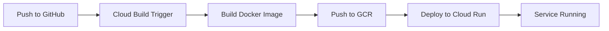

# Procuroid Backend Deployment Guide

## 🚀 Google Cloud Run Deployment

This guide covers deploying the Procuroid backend to Google Cloud Run using Cloud Build and GitHub integration.

### Prerequisites

1. **Google Cloud Account** with billing enabled
2. **Google Cloud Project** created
3. **GitHub Repository** connected to Google Cloud Build
4. **gcloud CLI** installed (optional, for manual deployment)

### Step 1: Enable Required APIs

Enable the following APIs in your Google Cloud Console:

```bash
gcloud services enable cloudbuild.googleapis.com
gcloud services enable run.googleapis.com
gcloud services enable containerregistry.googleapis.com
```

### Step 2: Set Up Environment Variables

In Google Cloud Run, configure these environment variables:

**Required:**
- `SUPABASE_URL` - Your Supabase project URL
- `SUPABASE_KEY` - Your Supabase service role key
- `SUPABASE_SERVICE_ROLE_KEY` - Supabase service role key

**Optional:**
- `ELEVENLABS_API_KEY` - For text-to-speech features
- `GOOGLE_API_KEY` - For Google Gemini AI
- `TWILIO_ACCOUNT_SID` - For SMS notifications
- `TWILIO_AUTH_TOKEN` - Twilio authentication
- `TWILIO_PHONE_NUMBER` - Your Twilio phone number

### Step 3: Connect GitHub to Cloud Build

1. Go to [Google Cloud Console](https://console.cloud.google.com)
2. Navigate to **Cloud Build > Triggers**
3. Click **Connect Repository**
4. Select **GitHub** and authenticate
5. Choose your repository: `avihhan/AIATL25`
6. Create a trigger with these settings:
   - **Name:** `procuroid-backend-deploy`
   - **Event:** Push to branch
   - **Branch:** `^main$`
   - **Configuration:** Cloud Build configuration file
   - **Location:** `procuroid-backend/cloudbuild.yaml`

### Step 4: Update cloudbuild.yaml (Optional)

Edit `cloudbuild.yaml` if you need to:

1. **Change region** (default: `us-central1`):
   ```yaml
   - '--region'
   - 'us-central1'  # Change to your preferred region
   ```

2. **Add environment variables**:
   ```yaml
   - '--set-env-vars'
   - 'VAR1=value1,VAR2=value2'
   ```

3. **Set secrets** (recommended for sensitive data):
   ```yaml
   - '--set-secrets'
   - 'SUPABASE_KEY=supabase-key:latest'
   ```

### Step 5: Deploy

**Automatic Deployment:**
- Push to `main` branch
- Cloud Build will automatically trigger
- Monitor progress in Cloud Build console

**Manual Deployment:**
```bash
# Build and deploy using gcloud CLI
cd procuroid-backend
gcloud builds submit --config cloudbuild.yaml ..
```

### Step 6: Verify Deployment

1. Get the service URL:
   ```bash
   gcloud run services describe procuroid-backend --region us-central1 --format 'value(status.url)'
   ```

2. Test the API:
   ```bash
   curl https://your-service-url.run.app
   ```

   Expected response:
   ```json
   {
     "message": "Procuroid Backend API",
     "version": "1.0.0",
     "status": "running"
   }
   ```

### Step 7: Update Frontend CORS

Add your Cloud Run URL to the frontend's allowed origins in `src/main.py`:

```python
allow_list = [
    "http://localhost:5173",
    "https://procuroid.vercel.app",
    "https://your-cloud-run-url.run.app",  # Add this
]
```

## 🐳 Local Docker Testing

Test the Docker image locally before deploying:

```bash
# Build the image
cd procuroid-backend
docker build -t procuroid-backend .

# Run the container
docker run -p 8080:8080 \
  -e SUPABASE_URL=your-url \
  -e SUPABASE_KEY=your-key \
  procuroid-backend

# Test
curl http://localhost:8080
```

## 📊 Monitoring & Logs

**View logs:**
```bash
gcloud run services logs read procuroid-backend --region us-central1
```

**Monitor in Console:**
- Navigate to **Cloud Run > procuroid-backend > Logs**

## 🔐 Security Best Practices

1. **Use Secret Manager** for sensitive data:
   ```bash
   # Create secret
   echo -n "your-api-key" | gcloud secrets create supabase-key --data-file=-
   
   # Grant access to Cloud Run
   gcloud secrets add-iam-policy-binding supabase-key \
     --member=serviceAccount:PROJECT_NUMBER-compute@developer.gserviceaccount.com \
     --role=roles/secretmanager.secretAccessor
   ```

2. **Enable authentication** if needed:
   - Remove `--allow-unauthenticated` from cloudbuild.yaml
   - Configure IAM policies

3. **Set up Cloud Armor** for DDoS protection

## 🔄 CI/CD Workflow



## 💰 Cost Optimization

- **Auto-scaling:** Cloud Run scales to zero when not in use
- **Memory allocation:** Start with 512MB, adjust based on usage
- **CPU allocation:** Use CPU only during request processing
- **Request timeout:** Set appropriate timeout (default: 120s)

## 🐛 Troubleshooting

**Build fails:**
- Check Cloud Build logs
- Verify all dependencies in requirements.txt
- Ensure Dockerfile syntax is correct

**Deployment fails:**
- Check IAM permissions
- Verify region availability
- Check environment variables

**Service errors:**
- Check Cloud Run logs
- Verify environment variables are set
- Test database connectivity

## 📚 Additional Resources

- [Cloud Run Documentation](https://cloud.google.com/run/docs)
- [Cloud Build Documentation](https://cloud.google.com/build/docs)
- [Container Registry Documentation](https://cloud.google.com/container-registry/docs)

